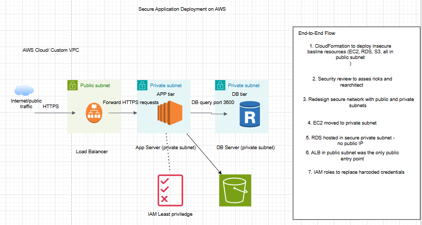

# Secure Application Deployment on AWS

> **Read the full project write-up on Medium:** [link]
> **Connect on LinkedIn:** [link]

---

## TL;DR

This project starts with a deliberately insecure AWS environment and rebuilds it from the ground up following the AWS Well-Architected Framework Security Pillar. EC2, RDS, and S3 are all initially exposed to the internet. By the end, the architecture is production-hardened with private subnets, least-privilege IAM, ALB-controlled ingress, and WAF protection.

---

## What This Project Demonstrates

- Identifying and documenting real-world AWS security misconfigurations
- Designing a secure VPC architecture with public and private subnet separation
- Applying least-privilege IAM across compute, database, and storage layers
- Securing public application access using ALB and AWS WAF
- Deploying infrastructure using CloudFormation (IaC)
- Thinking like a Security-Focused Solutions Architect

---

## Prerequisites

- AWS account with admin IAM user
- IAM billing access enabled
- Basic familiarity with AWS Console navigation
- AWS CLI installed (optional but recommended)

---

## Architecture Overview

### Baseline (Insecure) Architecture
Internet
│
▼
┌─────────────────────────────────────────┐
│              Public Subnet              │
│                                         │
│  EC2 (public IP, SSH open to 0.0.0.0/0)│
│  RDS (publicly accessible, port 3306    │
│       open to internet)                 │
│  S3  (no bucket policy enforced)        │
└─────────────────────────────────────────┘

### Secured Architecture (Final State)
Internet
│
▼
AWS WAF
│
▼
Application Load Balancer (Public Subnet)
│
▼
┌──────────────────────────────────────────┐
│             Private Subnet               │
│                                          │
│  EC2 (no public IP, Bastion access only) │
└──────────────────┬───────────────────────┘
│
▼
┌──────────────────────────────────────────┐
│          Private Database Subnet         │
│                                          │
│  RDS MySQL (private, encrypted,          │
│  security group: EC2 only on port 3306)  │
└──────────────────────────────────────────┘
S3 (bucket policy enforced,
no public access, encryption enabled)

---

## AWS Services Used

| Service | Role in Architecture |
|---|---|
| AWS CloudFormation | Deploys the insecure baseline environment as IaC |
| Amazon VPC | Network isolation, public/private subnet separation |
| Amazon EC2 | Application compute, moved to private subnet |
| Amazon RDS | MySQL database, secured in private subnet |
| Amazon S3 | Object storage, private with enforced bucket policy |
| Application Load Balancer | Controlled public ingress to private EC2 |
| AWS WAF | Web application firewall protection |
| AWS IAM | Least-privilege access control across all resources |

---

## CloudFormation Baseline Template

The insecure environment is deployed using a CloudFormation stack named `app-baseline-environment-stack`. This provisions all baseline resources in a single operation to make the security review structured and repeatable.

Key template parameters:

| Parameter | Default Value |
|---|---|
| EnvironmentName | `dev` |
| EC2Name | `web-app-server` |
| DBName | `appdb` |
| DBUsername | `appadmin` |
| DBPassword | `password123` (intentionally insecure) |

The template provisions:
- VPC (`10.0.0.0/16`) with two public subnets across two AZs
- Internet Gateway attached to the VPC
- Security group open to `0.0.0.0/0` on ports 22, 80, and 3306
- EC2 instance (`t3.micro`) with public IP in public subnet
- RDS MySQL (`db.t3.micro`, `PubliclyAccessible: true`)
- S3 bucket with no explicit bucket policy

> [📸 Screenshot: CloudFormation stack CREATE_COMPLETE with Resources tab expanded]

---

## Implementation Breakdown

### Implementation 1: Deploy the Insecure Baseline (CloudFormation)

Deploys the intentionally misconfigured environment using the CloudFormation template. Every resource is publicly exposed — EC2, RDS, and S3. This is the starting point for the security redesign.

**Validated misconfigurations confirmed:**
- EC2 has a public IP assigned
- Security group allows SSH from `0.0.0.0/0`
- RDS instance is publicly accessible on port 3306
- S3 bucket has no enforced access controls

> [📸 Screenshot: CloudFormation Resources tab showing deployed stack]
> [📸 Screenshot: EC2 console showing public IP and security group inbound rules]
> [📸 Screenshot: RDS console showing Public Accessibility = Yes]

---

### Implementation 2: Security Review of the Baseline

A structured security assessment of the deployed environment. Documents every misconfiguration, explains the risk it poses in a real environment, and maps it to the AWS Well-Architected Framework Security Pillar.

**Issues identified:**
- No network isolation — all resources in public subnet
- Security group exposes port 3306 to the internet (database directly accessible)
- No least-privilege IAM applied
- No encryption at rest or in transit enforced
- S3 bucket has no intentional access policy

---

### Implementation 3: Design a Secure Network Foundation (VPC & Subnets)

Creates a custom VPC with properly separated public and private subnets across two availability zones. Public subnets host only the ALB and Bastion. Private subnets host EC2 and RDS.

**VPC Configuration:**

| Setting | Value |
|---|---|
| VPC CIDR | `10.0.0.0/16` |
| Public Subnet A | `10.0.1.0/24` (AZ-1) |
| Public Subnet B | `10.0.2.0/24` (AZ-2) |
| Private Subnet A | `10.0.3.0/24` (AZ-1) |
| Private Subnet B | `10.0.4.0/24` (AZ-2) |

> [📸 Screenshot: VPC resource map showing subnet layout]

---

### Implementation 4: Secure Compute Deployment (Private Subnets)

Moves EC2 into a private subnet. Removes the public IP. Configures a Bastion host in the public subnet as the only SSH entry point. Updates the security group to restrict access appropriately.

**Security group rules (EC2):**

| Rule | Source | Port |
|---|---|---|
| SSH | Bastion security group only | 22 |
| HTTP | ALB security group only | 80 |

> [📸 Screenshot: EC2 instance in private subnet with no public IP]
> [📸 Screenshot: Security group inbound rules]

---

### Implementation 5: Secure Public Access via ALB

Deploys an Application Load Balancer in the public subnet to control all inbound traffic to the private EC2. Adds AWS WAF with managed rules to protect against common web-based attacks including SQL injection and XSS.

> [📸 Screenshot: ALB target group showing healthy EC2 target]
> [📸 Screenshot: WAF web ACL with managed rules associated to ALB]

---

### Implementation 6: Secure the Data Layer (RDS & S3)

Moves RDS into a private database subnet. Updates the security group to allow inbound traffic on port 3306 only from the EC2 security group. Enables encryption at rest. Applies an S3 bucket policy to enforce private access and enables server-side encryption.

**RDS security group rule:**

| Rule | Source | Port |
|---|---|---|
| MySQL/Aurora | EC2 security group ID | 3306 |

> [📸 Screenshot: RDS in private subnet with Public Accessibility = No]
> [📸 Screenshot: S3 bucket policy and encryption settings]

---

## Key Design Decisions

**Why CloudFormation for the baseline?**
Deploying the insecure environment as IaC made the security review structured and repeatable. It also demonstrates the ability to read, write, and deploy CloudFormation templates — a core cloud engineering skill.

**Why ALB instead of direct EC2 public access?**
ALB decouples public internet access from the application server. The EC2 never needs a public IP, which dramatically reduces the attack surface. WAF can be attached to ALB but not directly to EC2.

**Why separate public and private subnets?**
Defense in depth. Even if the ALB is compromised, the EC2 and RDS are not reachable from the internet. Each layer requires a deliberate breach to reach the next.

---

## Skills Demonstrated

- AWS security architecture and hardening
- VPC design and network segmentation
- CloudFormation (IaC) deployment and review
- IAM least-privilege design
- Application Load Balancer configuration
- AWS WAF implementation
- RDS and S3 data layer security
- AWS Well-Architected Framework (Security Pillar)

---

## Related

- Medium article: [link]
- LinkedIn: [link]
